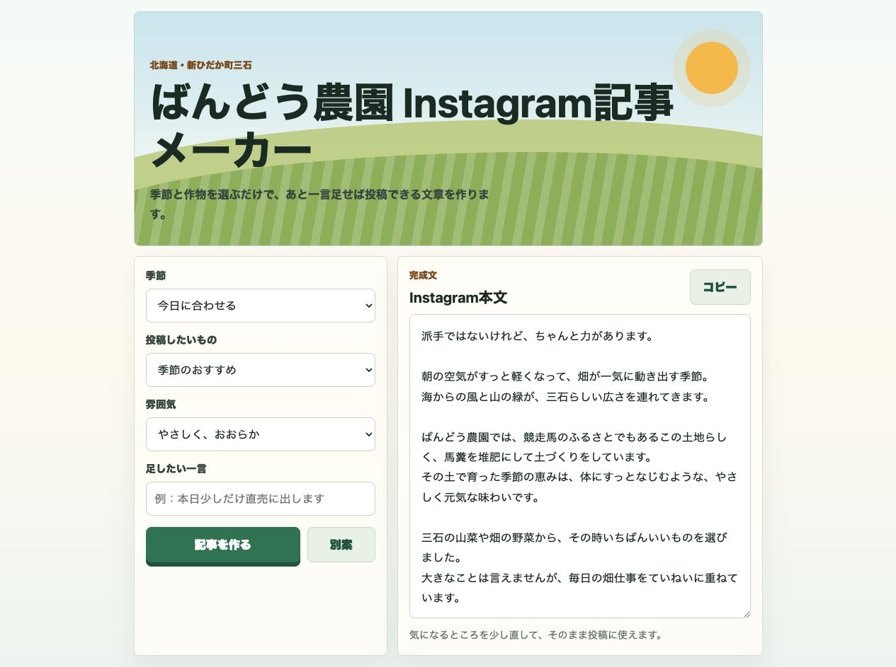

# ばんどう農園 Instagram記事メーカー

北海道・新ひだか町三石にある「ばんどう農園」向けの、Instagram投稿文を作る小さなWebアプリです。

季節、投稿したい作物、文章の雰囲気を選ぶと、あと一言書き足せば使えるくらいの投稿文を作れます。

[公開ページを見る](https://psychic-robot-sepia.vercel.app)



## どんな人向け？

- Instagramの投稿文を毎回考えるのが少し大変な人
- 農園らしい、やさしい雰囲気の文章をすばやく作りたい人
- スマホで見やすい投稿文作成ツールを使いたい人

## できること

- 季節に合わせた文章を作れます
- 山菜、ピーマン、トマト、スイカ、なす、いちご、ジャムなどを選べます
- 「やさしく、おおらか」「みずみずしく元気」など、文章の雰囲気を選べます
- ばんどう農園らしい、馬糞堆肥の土づくりや北海道三石の空気感を入れられます
- 出てきた文章をコピーしてInstagramに貼り付けられます

## 使い方

公開ページで使う場合:

1. [公開ページ](https://psychic-robot-sepia.vercel.app) を開きます
2. 「季節」「投稿したいもの」「雰囲気」を選びます
3. 必要なら「足したい一言」に販売日や直売情報を書きます
4. 「記事を作る」を押します
5. 文章を確認して「コピー」を押します
6. Instagramに貼り付けます

手元のファイルで使う場合:

1. `index.html` をダブルクリックします
2. ブラウザでアプリが開きます
3. 「季節」「投稿したいもの」「雰囲気」を選びます
4. 必要なら「足したい一言」に販売日や直売情報を書きます
5. 「記事を作る」を押します
6. 文章を確認して「コピー」を押します
7. Instagramに貼り付けます

## 初心者向けの説明

このアプリは、特別なインストールなしで動きます。

`index.html` は、アプリの入口です。  
スマホやパソコンのブラウザで開くと、画面が表示されます。

`style.css` は、見た目を整えるファイルです。  
色、余白、スマホで見やすい形などをここで決めています。

`script.js` は、文章を作るためのファイルです。  
季節や作物を選んだ時に、Instagram用の文章を組み立てています。

## ファイル構成

```text
.
├── index.html
├── style.css
├── script.js
├── README.md
├── WORKLOG.md
└── docs/
    └── screenshot.jpg
```

## 文章に入れている要素

- Instagramアカウント名: ばんどう農園
- 場所: 北海道・新ひだか町三石
- 特色: 競走馬のふるさとらしい馬糞堆肥の土づくり
- 地域らしさ: 日高昆布、三石羊羹、山菜がある土地の空気感
- 作物: 山菜、ピーマン、トマト、スイカ、なす、いちご、ジャムなど

## 公開について

このリポジトリはGitHubで公開されています。

アプリはVercelで公開されているので、URLを共有するとブラウザから使えます。
